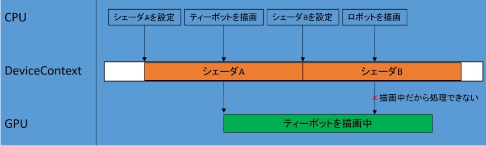
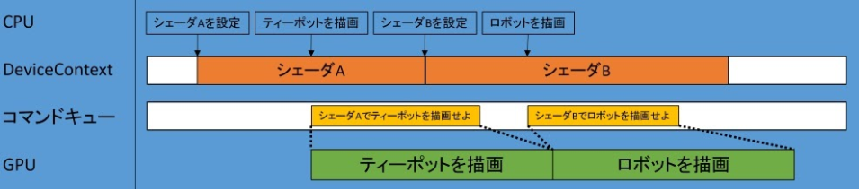
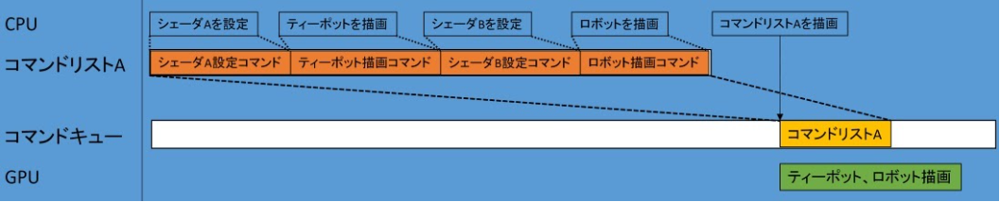

# DirectX12のコマンドについて
## コマンドという概念
### DirectX11ではDeviceContextを使って描画命令を送っていた
- シェーダーや頂点バッファ、インデックスバッファ等を設定してDrawCallを行う
- ただ内部ではコマンドの形で処理をしている

### コマンドで処理してない場合
- DirectX11で内部的にコマンド処理していないイメージ
  - DrawCallはCPUから発行して、GPUが処理する
    - CPUとGPUのマルチスレッドみたいなもの
  - GPUが描画中にCPUからまたDrawCallを行うとバッティングしちゃう

  

### コマンドで処理する場合
- DirectX11で内部的にコマンド処理しているイメージ
  - CPUでDrawCallした際にGPUに直接描画させるのではなくコマンドキューに命令を積む
  - GPUは処理してない場合、コマンドキューから命令を取ってきて処理する
  - 処理が終わればまた、コマンドキューから命令を取ってきて処理する

  

### DirectX12のコマンド処理の場合
- CPU側でシェーダの設定、描画の命令をコマンドリストに積む
  - 1フレーム内の描画を全てコマンドリストに積む
- CPU側で積まれたコマンドリストを実行する命令を送る
  - コマンドキューに、積まれているコマンドリストを送る
- CPU側でコマンドキューからデータをもらって描画する

  

## コマンドの生成
### コマンドキューの生成
```
D3D12_COMMAND_QUEUE_DESC desc = {};
desc.Flags = D3D12_COMMAND_QUEUE_FLAG_NONE;	// GPUのタイムアウト処理が有効
desc.Type = D3D12_COMMAND_LIST_TYPE_DIRECT;	// 直接コマンドキュー

HRESULT hr = device->CreateCommandQueue(&desc, IID_PPV_ARGS(&cmdQueue));	// コマンドキュー生成
assert(SUCCEEDED(hr));
```
- `D3D12_COMMAND_QUEUE_DESC::Type` (desc.Type)
  - 通常のグラフィックスパイプラインなら`D3D12_COMMAND_LIST_TYPE_DIRECT`
  - コンピュートパイプラインなら`D3D12_COMMAND_LIST_TYPE_COMPUTE `
    - コンピュートシェーダ専用のパイプラインで使うコマンドキュー
    - コンピュートシェーダの処理とグラフィックスパイプラインの描画処理を並列に行える
  - コピーパイプラインなら`D3D12_COMMAND_LIST_TYPE_COPY `
    - バッファやテクスチャーなどのリソースコピーを行う為のコマンドキュー
    - リソースコピーとグラフィックスパイプラインの描画処理を並列に行える
- `D3D12_COMMAND_QUEUE_DESC::Flags` (desc.Flags)
  - GPUのタイムアウト処理を有効にする場合、`D3D12_COMMAND_QUEUE_FLAG_NONE`
  - GPUのタイムアウト処理を無効にする場合、`D3D12_COMMAND_QUEUE_FLAG_DISABLE_GPU_TIMEOUT`
    - 基本タイムアウト処理は有効でよい
      - GPU処理で問題が起きた場合、タイムアウト処理で止めることができる
      - タイムアウトしない場合他の機能やOSを巻き込んで停止してしまう可能性がある

### コマンドアロケータの生成
```
HRESULT hr = device->CreateCommandAllocator(D3D12_COMMAND_LIST_TYPE_DIRECT,
											 IID_PPV_ARGS(&cmdAllocator));
assert(SUCCEEDED(hr));
```
- コマンドキューと同じタイプを指定する(第1引数)
  - コマンドキューのタイプを`D3D12_COMMAND_LIST_TYPE_DIRECT`にしてる場合のみ
    - `D3D12_COMMAND_LIST_TYPE_BUNDLE`を指定できる
      - 事前にコマンドを積んでおいて再利用する？

### コマンドリストの作成
```
HRESULT hr = device->CreateCommandList(0,	// 複数のGPUノードがある場合、識別の番号をセット
										 D3D12_COMMAND_LIST_TYPE_DIRECT,
										 cmdAllocator,
										 nullptr,	// パイプラインステート
										 IID_PPV_ARGS(&cmdList));
assert(SUCCEEDED(hr));

cmdList->Close();	// コマンドリストはクローズされた状態からにしておく（念のため初期化）
```
- GPUノードに対する識別用のビット(第1引数)
  - 単一のGPU操作の場合、0でよい
- コマンドキューと同じタイプを指定する(第2引数)
- 作成したコマンドアロケータを指定する(第3引数)
  - コマンドバッファを確保するためにコマンドアロケータを使用する
    - コマンドバッファの領域にコマンドリストを割り当てるので必要

### ループ処理
```
// コマンドアロケータをリセット
HRESULT hr = cmdAllocator->Reset();
assert(SUCCEEDED(hr));

// コマンドリストをリセット
hr = cmdList->Reset(cmdAllocator, pipelineState);
assert(SUCCEEDED(hr));
```
- 描画開始
  - コマンドアロケータのリセットでコマンドバッファの領域を解放
  - コマンドリストのリセットでコマンドリストの積んでるものを空にする
```
// ビューポートとシザーボックスの設定
cmdList->RSSetViewports(1, &viewPort);
cmdList->RSSetScissorRects(1, &scissorRect);
```
- コマンドリストに命令を積む
  - 例
    - 使用するビューポートの指定
    - 指定した矩形でクリッピング
```
// コマンドリストのクローズ
cmdList->Close();
```
- コマンドリストへの積みを終了
  - クローズしてないと実行できない
```
// コマンドリストを実行する
ID3D12CommandList* pCommandLists[] = {cmdList};
cmdQueue->ExecuteCommandLists(_countof(pCommandLists),
								pCommandLists);
```
- 複数のコマンドリストをキューに詰め込む命令
  - 先頭から順に処理する

