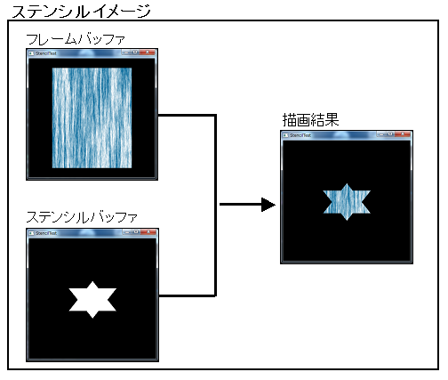

# ステンシルバッファについて
 - 各ピクセルに対応するステンシルデータを格納する特殊なバッファ。
 - スワップチェーンのバックバッファと組み合わせて使用する

    
## ステンシルテスト
 - 用意したステンシルデータの内容に合わせて描画の判定を行うことができる
 - 描画されるピクセルとステンシルバッファの内容を比較し、特定の条件を満たすかどうかが判定
   - 合格：描画が続行され、デプスバッファが更新される
   - 不合格：描画が行われず、デプスバッファの更新も行われない

    

## ステンシルテストの条件
### `D3D11_DEPTH_STENCIL_DESC`構造体
 - ステンシルテストの有効化 / 無効化
   - `StencilEnable`：true / false
 - ステンシル関数
   - ステンシルテストに使用される比較関数
   - `StencilFunc`：`D3D12_COMPARISON_FUNC`列挙
     - `D3D12_COMPARISON_FUNC_LESS`：データが変換先データより小さい場合、比較は成功
     - `D3D12_COMPARISON_FUNC_EQUAL`：データが変換先データと等しい場合、比較は成功
     - `D3D12_COMPARISON_FUNC_GREATER`：データが変換先データより大きい場合、比較は成功
 - ステンシルの読み取りマスクと書き込みマスク
   - ステンシル値の読み取りor書き込みに使用されるマスクを指定
   - `StencilReadMask`：読み取るステンシル値のマスク
     - ```
  		例：StencilReadMask = 0xff; // 全てのビットを読み込む
   - `StencilWriteMask`：書き込むステンシル値のマスク
     - ```
  		例：StencilWriteMask = 0x00; // 書き込みなし
 - ステンシルの比較と操作
   - ステンシルテストの比較後にステンシル値を変更できる
   - `D3D12_STENCIL_OP`列挙 
     - `D3D12_STENCIL_OP_KEEP`：既存のステンシルデータを保持
     - `D3D12_STENCIL_OP_ZERO`：ステンシルデータを0に操作
     - `D3D12_STENCIL_OP_INCR_SAT`：ステンシル値を1ずつインクリメント
   - `StencilFailOp`：ステンシルテストが失敗したときに実行するステンシル操作
   - `StencilDepthFailOp`：ステンシルテストが成功し、Zテストが失敗したときに実行するステンシル操作
   - `StencilPassOp`： ステンシルテストとZテストの両方に合格したときに実行するステンシル操作

