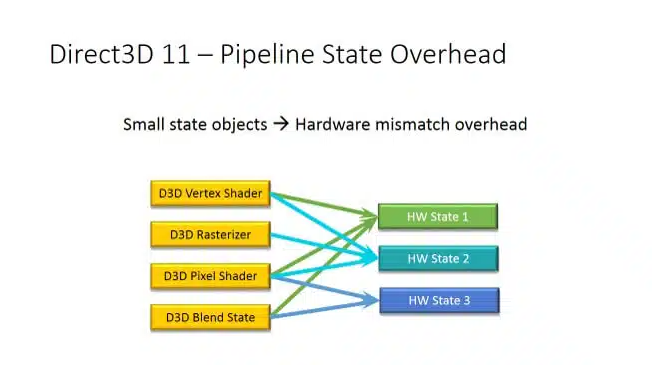
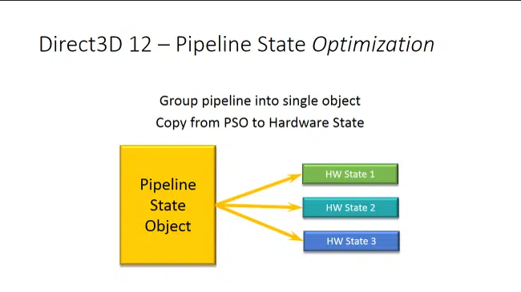

# グラフィックスパイプラインステートについて
## DirectX11までのグラフィックスパイプラインの設定
 - DirectX11ではそれぞれのパイプライン設定を個別で管理、セットしていました
 - 入力アセンブラステージ
    ```
    device->CreateInputLayout(layout, 1, vsBlob->GetBufferPointer(), vsBlob->GetBufferSize(), &inputLayout);
    ```
 - 頂点シェーダーステージ
    ```
    device->CreateVertexShader(vsBlob->GetBufferPointer(), vsBlob->GetBufferSize(), nullptr, &vertexShader);
context->VSSetShader(vertexShader.Get(), nullptr, 0);
    ```

## DirectX12でのグラフィックスパイプラインの設定
 - DirectX12ではPSO（パイプラインステートオブジェクト）がパイプラインを管理
 - PSOに各ステージ、シェーダー、ブレンドステートなどの設定を行う
### メリット
 - GPUの効率が向上
   - まとめて設定するほうがオーバーヘッドが少なくなりパフォーマンスが向上
     - PSO内の各情報はそれぞれ依存関係があるので個別にセットしていく場合、他のデータも辻褄合わせしないといけなかった
     - GPUが各パイプライン状態の中のすべての依存設定を前処理できるためレンダリング時の切り替えふぁできるだけ効率よく行うことができる

      
   - 各ハードウェアステートとの依存関係
     - DirectX11

     

     - DirectX12

     

     - HWState1：シェーダーコード
     - HWState2：ラスタライザとラスタライザとのシェーダーリンク
     - HWState3：ブレンドとピクセルシェーダーの間のリンク
     - ドライバは依存関係が解決するまで動かないのでDirectX11では待ち時間が発生する

### デメリット
 - PSO自体の生成は処理が重いので生成タイミングなどは注意が必要
   - `CachedPSO`といって全く同じPSOの設定であればキャッシュから生成できるのでパフォーマンスが良い
   - ただし、設定が違っている場合やドライバの更新などで情報が書き換わってる場合は失敗する
     - `CachedPSO`はハードウェアやドライバの情報もふくまれている
- 管理が大変
  - 下記のマテリアルをそれぞれ描画する場合
    - マテリアルA：「不透明・深度テスト有効・深度書き込み有効」
    - マテリアルB：「半透明・深度テスト有効・深度書き込みなし」
    - マテリアルC：「加算合成・深度テスト有効・深度書き込みなし」
  - DirectX11の場合
    - ブレンドステートの「不透明、半透明、加算合成」をそれぞれ用意
    - 深度ステートの「テスト有効書き込み有効、テスト有効書き込みなし」をそれぞれ用意
    - それぞれのステートを組み合わせてマテリアルを描画
  - DirectX12の場合
    - それぞれのマテリアルでPSOを管理
