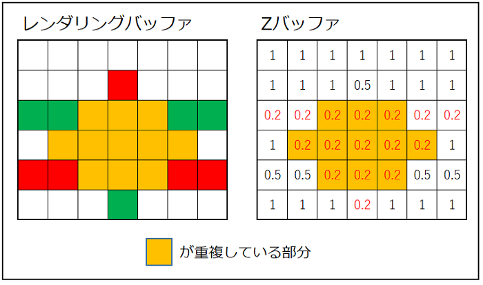

# デプスバッファについて
 - 奥行き（深度）情報を格納する特殊なバッファ。
 - スワップチェーンのバックバッファと組み合わせて使用する
## 奥行き情報の格納
 - デプスバッファは各ピクセル毎に対応する奥行き値を格納
   - シーン内のオブジェクトがカメラからどれだけ奥に位置しているかの値
## テクスチャのフォーマット
 - 奥行き情報をどのような形式で格納するかを指定
 - 例えば`DXGI_FORMAT_D32_FLOAT`の32ビットの浮動小数点数
## 深度範囲
 - 奥行き情報は0.0から1.0までの範囲に正規化
   - 0.0：カメラから近い
   - 1.0：カメラから遠い
## クリア値
 - フレームの描画開始前に、デプスバッファをクリア
## Zテスト
 - 不要な描画処理を無視できる
 - ピクセルの描画が行われる前に、そのピクセルの奥行き値がデプスバッファの対応する位置の奥行き値と比較される
   - 新しいピクセルが既存のピクセルよりも手前にある場合（深度値が小さい）
     - ピクセルへの描画が行われる
     - 新しいピクセルの深度値をデプスバッファに更新する
 - 描画時には、新しいピクセルの奥行き情報と既存のピクセルの情報を比較
   - 奥行き情報が前面にあるピクセルのみ描画

