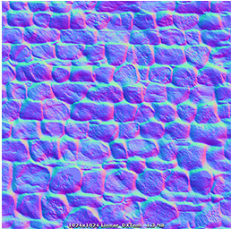
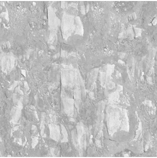
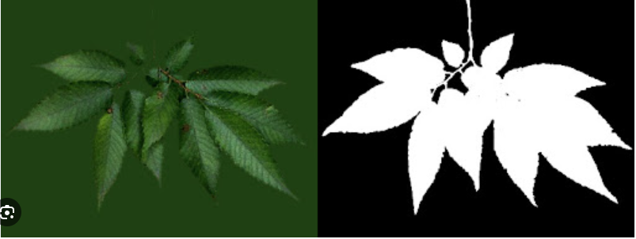

# テクスチャの種類について
## カラーマップ（アルベドマップ）
 - 3Dモデルの表面に適用される基本的な色情報を含むテクスチャ
 - 表面の基本的な色情報やパターンを表現するために使用
 - テクスチャと聞いて一番最初に想像するであろう使い方

## 法線マップ
 - 3Dモデルの表面の微小な凹凸を表現するためのテクスチャ
### 特徴
 - 各ピクセルは、表面の法線ベクトルを表している
 - 法線マップは通常、タンジェント空間（テクスチャ座標系）で表現される（別記事で詳しく）
### 使い方
 - 光の反射や陰影を計算する際に表面の形状を正確に反映させるためのもの
 - ジオメトリのポリゴン数を増やさずに、表面の凹凸を表現できる

## ディスプレイスメントマップ
 - ポリゴンの頂点位置を変更して、より詳細で複雑な形状を持つ表面を生成するためのテクスチャ
 - 法線マップよりも表面の形状に大きな影響を与えることができる

 - 実際にポリゴンの頂点を変形するので法線マップでの凹凸表現に比べて品質、負荷ともに高い

## スペキュラマップ
 - 物体表面が光を反射する際の反射の強さや色情報を示すテクスチャ
 - 主に物体の光沢や反射特性を制御するために使用される
### 特徴
 - スペキュラマップの値が高い領域は、強く光を反射し、光沢があるように見える
 - スペキュラマップは通常、RGB成分を使用して反射の色情報を表現
   - 反射が物体の基本的な色（カラーマップ）とは異なる色を持つことが可能
### 使い方
 - スペキュラマップは通常、フォンシェーディングやブリン・フォンシェーディングモデルなどと組み合わせて使用される
 - 光源と視点の位置に基づいて、スペキュラマップの情報が使用され、物体の反射が計算される

## 環境マップ
 - 3Dオブジェクトやシーンの周囲の環境、光の情報を表現するための特殊なテクスチャ
 - キューブマップとして知られる立方体状のマップが使われる（詳しくは別記事で）

## アルファマップ（透明度マップ）
 - 各ピクセルごとに透明度（アルファ値）を示すテクスチャ
 - RGB成分は色情報を表し（カラーマップ）、アルファ成分は透明度を表現する
 - オブジェクトの不透明度や透明度を制御して、シーン内のレイヤー間に合成する

