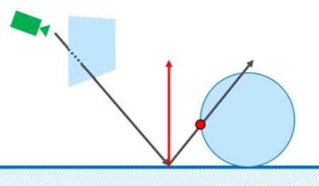
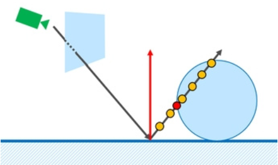
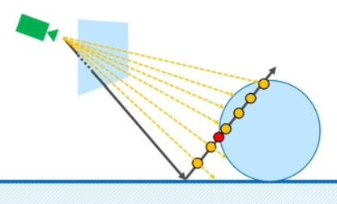
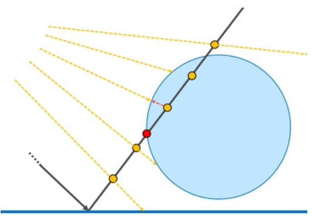
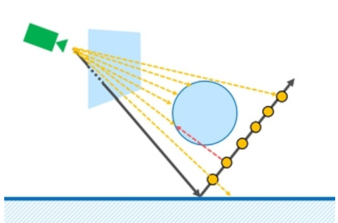
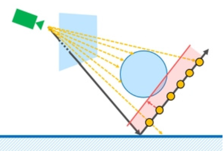

# SSR（スクリーンスペースリフレクション）について
 - 3Dオブジェクトやシーンの周囲の環境を動的に反映させる技術
 - 環境マップ
   - 予め周囲の反射させる背景テクスチャを用意しておき、リアルタイムでそのテクスチャから色を取ってくる
     - メリット
       - カメラの視線と物体の法線ベクトルを用いて1度反射ベクトルを求めればよいの計算量が少ない
     - デメリット
       - 環境マップで用意したテクスチャの色しか読み取れないので、使用には制限がある
 - SSR
   - メリット
     - リアルタイムで反射した色をとってくるので動的に変化するシーンの映り込みを表現できる
   - デメリット
     - 計算量が多く、リアルタイムで行うので負荷が大きい
     - スクリーン上に描画されている色しか取れないので描画外の映り込みは表現できない

## SSRの仕組み
 - 簡単にいうとピクセル単位でレイトレーシングを行い反射先の色を取得し反映する
### レイトレーシングに必要な情報
 - レイトレーシングで反射させるには物体を反射するための情報が必要
 - 下記の情報から反射を反映する物体の反射ベクトルを求める
   - カメラの位置
   - 反射を反映する物体の位置
   - 反射を反映する物体の法線ベクトル
 - G-Bufferの利用
 - 一度画面を描画してG-Bufferに色、カメラ空間の座標、法線ベクトル、**深度情報**を格納しておく
   - （実はカメラ空間の深度情報さえあれば位置、法線を復元できるみたいだが割愛）

### 反射ベクトルの衝突点を計算
 - 反射ベクトルを使ってシーンとの衝突判定を行う
 - 下記の図でいうと物体の反射ベクトルは球体の赤点部分に反射している

    

 - 反射ベクトルに向かって少しずつ進めていく

    

 - 衝突したかを判定するには、カメラ空間の深度情報を使用する
   - 反射ベクトルに向かって少し進めて、その地点のカメラから見た深度情報を算出する
   - G-Bufferに格納しておいた深度情報と比較する
     - レイの地点の深度値の方が大きい場合は何かに衝突してるとみなすことができる

    
    

 - 例より手前の物体かの判定
   - レイと深度値の判定だとレイより手前にある物体の衝突判定もとってしまう

    

   - これをある程度解消するには固定の領域内に深度値があるかをチェックする

    

   - 実装は楽だが固定値による判定は、物体の実際の形状や位置に依存せず、非現実的な表現につながる可能性が固ある

 - ※後半でその解決を書く