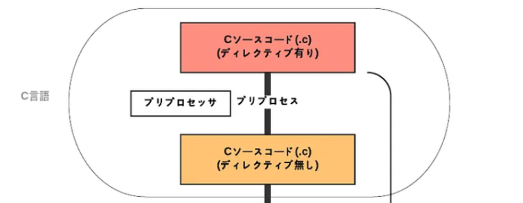
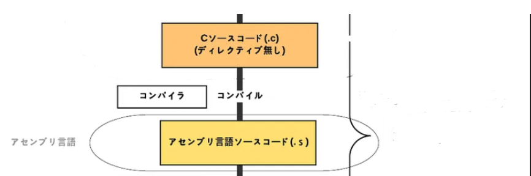

# ビルドについて

## プリプロセッサについて
 - プリプロセッサはソースコード中の`#include`や`#define`などのプリプロセッサディレクティブを処理する過程
 - ソフトウェアの柔軟性と保守性を向上させるために重要なステップ
 - ビルドプロセスの初期段階でコードを事前に変換しておくことで、より効率的なコードの生成が可能
### マクロ
 - マクロは、ソースコード中に定義された簡単な置換規則
 - `#define`ディレクティブを使用してマクロを定義し、コード中でそのマクロを使用する
 - プリプロセッサがコード中のマクロを対応する置換テキストに置き換える
```
#define MAX(a, b) ((a) > (b) ? (a) : (b))

// プリプロセッサにより置換されて int result = ((10) > (5) ? (10) : (5));
int result = MAX(10, 5);  
```

### ヘッダーファイルの結合
 - `#include`ディレクティブを使用して、指定したヘッダーファイルをソースコードに結合する
 - 他のファイルで定義された関数や変数を利用するために使用
```
#include "myheader.h"
```

### 条件付きコンパイル、条件付きヘッダーの使用
 - `#ifdef`、`#ifndef`、`#else`、`#endif`などのディレクティブを使用して、特定の条件が満たされた場合にコードの一部をコンパイルするかどうか決める
```
#ifdef DEBUG
#include "debugUtility.h"
#endif
```




## コンパイル
 - 高水準言語で書かれたソースコードを機械語や中間言語に変換するプログラム
### 構文解析
 - プログラムの構造や文法に従っているかどうかを確認
 - これにより、構文エラーや文法エラーを検出
### 意味解析
 - 構文解析後、コンパイラはプログラムの意味を解析する
 - 変数の宣言や型の整合性など、意味的なエラーを検出
### 中間コード生成
 - 意味解析が終わると、コンパイラは中間コードを生成する
 - 中間コードは、プログラムを高水準言語から機械語へ変換する際に生成される
   - プラットフォームに依存しないコードなのでプラットフォームに合わせたコンパイルは必要ない
   - プログラムを解析、最適化、および変換するための効果的な形式を提供する
### 最適化
 - 生成された中間コードをより効率的な形に変換するプロセス
 - ンパイラは、プログラムの実行速度やメモリ使用量などを最適化する


