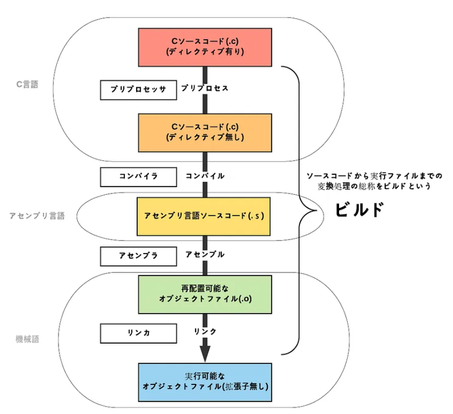

# ビルドについて

## アセンブル
 - 最適化が完了すると、コンパイラは最終的な機械語コードに変換する
   - （もしくはプラットフォーム固有の中間コード）
 - この段階で、プログラムが実際にハードウェアで実行されるためのブジェクトファイルが生成される
 - ※まだ他のオブジェクトファイルやライブラリと結合されていません。

## リンカー
 - 外部ライブラリといった複数のオブジェクトファイルを結合し、最終的な実行可能ファイルやライブラリを生成するプログラム
### シンボル解決
 - シンボルとは
   - 変数や関数などがどこに定義されているかを抽象的に示すもの
   - リンク時にシンボルを解決することで実際のメモリアドレスやデータに関連付けされる
 - 各オブジェクトファイルは、プログラム内の変数や関数などのシンボルを持っている
 - コンパイルやアセンブリの段階では、プログラム内のシンボルは抽象的なまま
 - 実際のメモリアドレスやデータに具体的な値を関連付けるプロセスのことをシンボル解決という
### プログラムの結合
 - 各オブジェクトファイルや外部ライブラリを結合し、単一の実行可能ファイルやライブラリを生成
 - この結合プロセスにより、各オブジェクトファイルが持つコード・データが最終的なプログラムの一部になる
### アドレスの修正
 - 各オブジェクトファイルを結合したことで参照しているメモリアドレスなどが被らないように修正する必要がある
 - これにより、オブジェクトファイルの相対的なアドレスを統合的に解決し、最終的なメモリ配置を行う
### 実行可能ファイルの生成
 - アドレス修正が完了すると、リンカは最終的な実行可能ファイルを生成
 - このファイルには、各シンボルが正確なメモリアドレスに配置されたバイナリデータが含まれる

## ビルド全体の流れ
 - プリプロセッサ
   - 置換コードを置き換える
 - コンパイル
   - 高水準言語を中間コードや機械語に変換したファイル生成
 - アセンブル
   - 中間コードを機械語に変換したファイル生成
 - リンカ
   - 各オブジェクトファイルを結合しシンボル解決を行いメモリアドレスの配置を行う

